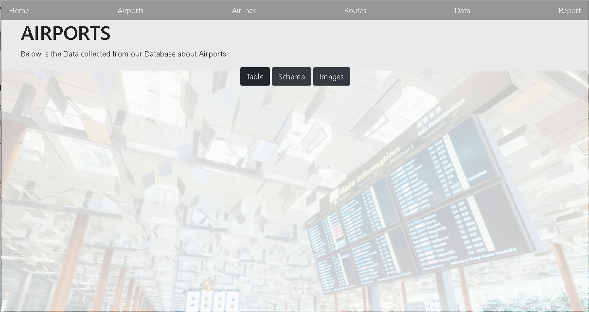
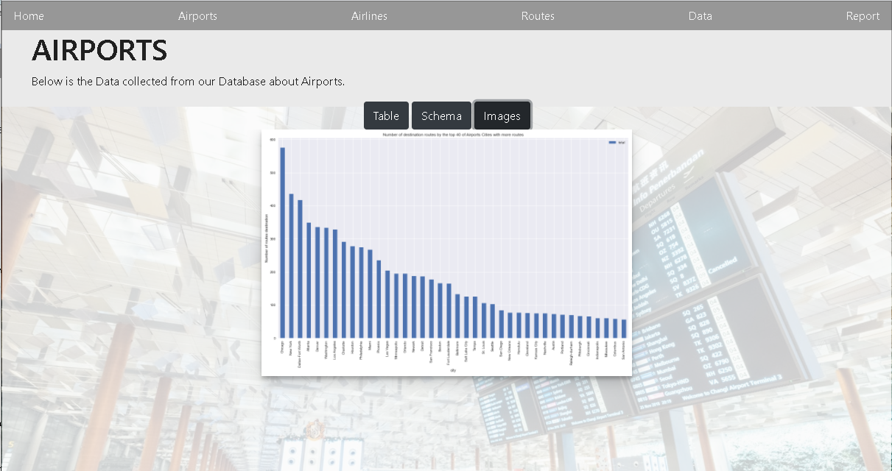
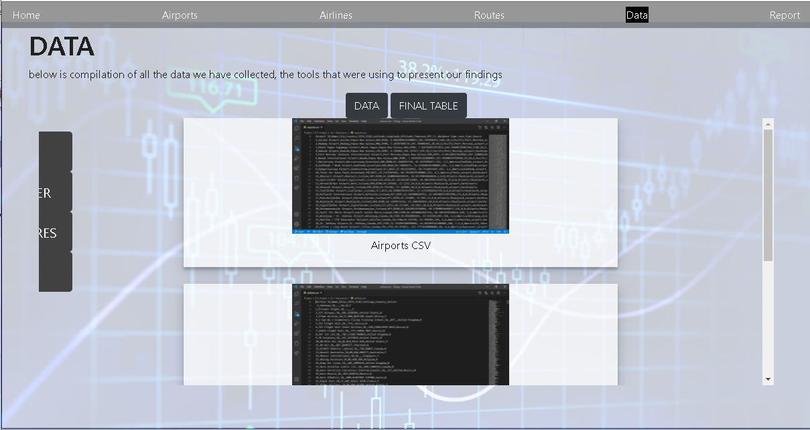
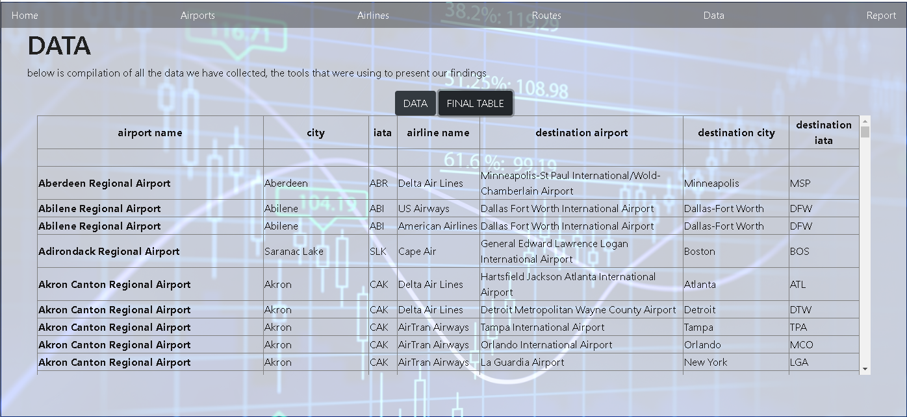
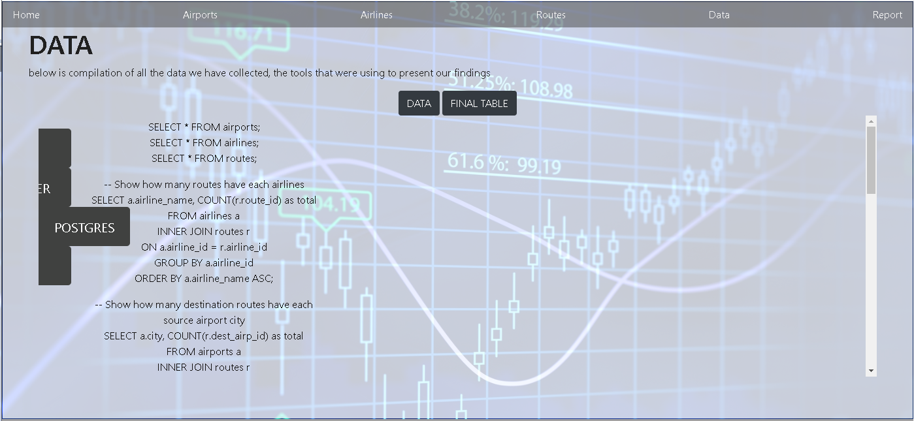
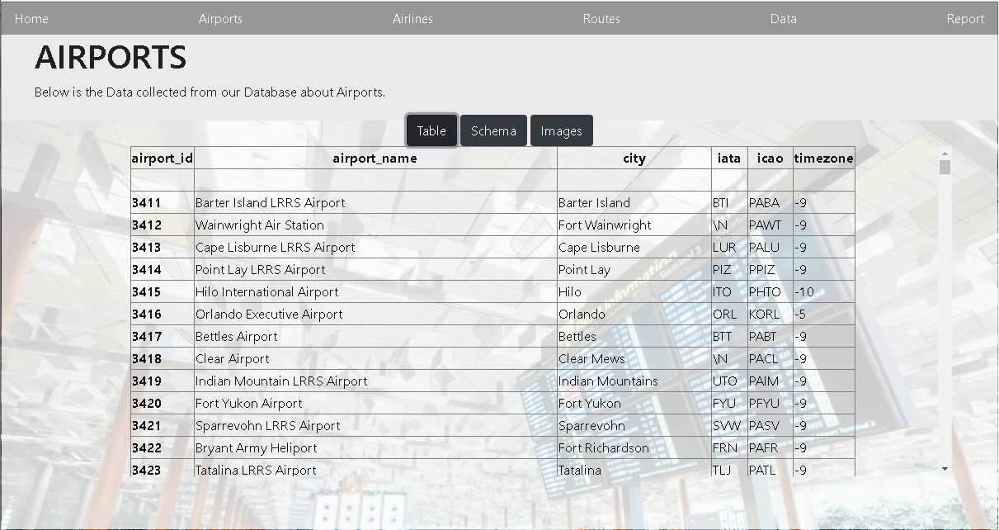

# ETL Projec - UCF Data Analytics and Visualization Bootcamp

## an inside look of the Data of Airpotrs, Airlines and Routes

We are pulling 3 sets of data from data.world about airports, routes and airlines. In which we will be using Pandas and Jupyter lab to clean the data to only include airports operations in the US. Some additional data that we will be using are the airports codes (IATA) as the primary key that will assist us in making an engine connection through Jupyter lab to push the data into our Postgres database  so we can create an accurate database and three tables for each respective column. 

After all the data has being processed accordingly we will create an ERD to show the content of each table, along with its Primary key and its relationship to other tables and to finalize the ETL Project we will take all the data collected and publish it on a website that will include in addition to our proposal, 3 links for the sets of data that we worked on along with a page for the ERD graph.

## Team Members
  * Sam Azhari
  * Alciluz Gomez 
  * Ian Castro  

## Data Story

[Airlines.csv](https://data.world/tylerudite/airports-airlines-and-routes/workspace/file?filename=airlines.csv )
[Aiports.csv](https://data.world/tylerudite/airports-airlines-and-routes/workspace/file?filename=airports.csv  )
[Routes.csv](https://data.world/tylerudite/airports-airlines-and-routes/workspace/file?filename=routes.csv )

Airports, Airlines, and Routes is a comprehensive dataset which includes air travel data including airports, airlines, routes, and airplanes. The database contains over 10,000 data points compiled by OpenFlights (https://openflights.org) collected from a variety of sources.
Additional information is available here - https://openflights.org

## Aplications

* HTML/CSS/Bootstrap
* Python
* Pandas
* SQLAlchemy

## Web Page Description

[linktoindex.html](https://flbpilot.github.io/ETL-Project/)

This first section of the webpage show a navbar with menu next options: 
 * Home : Will take you to the first section.
 * Airports: Will show the Data collected from our database about Airports. 
 * Airlanes: Will show the Data collected from our database about Airlanes.
 * Routes: Will show the Data collected from our database about Ailrine Routes.
 * Data: Will show a compilation of all the data we have collected, the tools that were using to present our findings
 * Report: Will show a report of the project.

For each table of the Database we have the same screen. Each table have tree options: Table, Schema and Images.
* Table: Will show the table data.

* Schema: Will show the SQL query used to create the table.

* Image: Will show the chart containing infomration about the table example for Airports it will show a chart of all the airport vs number of destination routes.

For the Data option you will have two more options:
* Data: Will show the Data set in different versions. Using the dropdown menu at the side:

* CSV: Will show the csv files

* Postgres: Will show all the querys used

* Jupyter: Will show the Jupyter notebook

*ERD: Will show the ERD diagram

* Final Table: Will show a table created with all the airports listing all their destination city.

